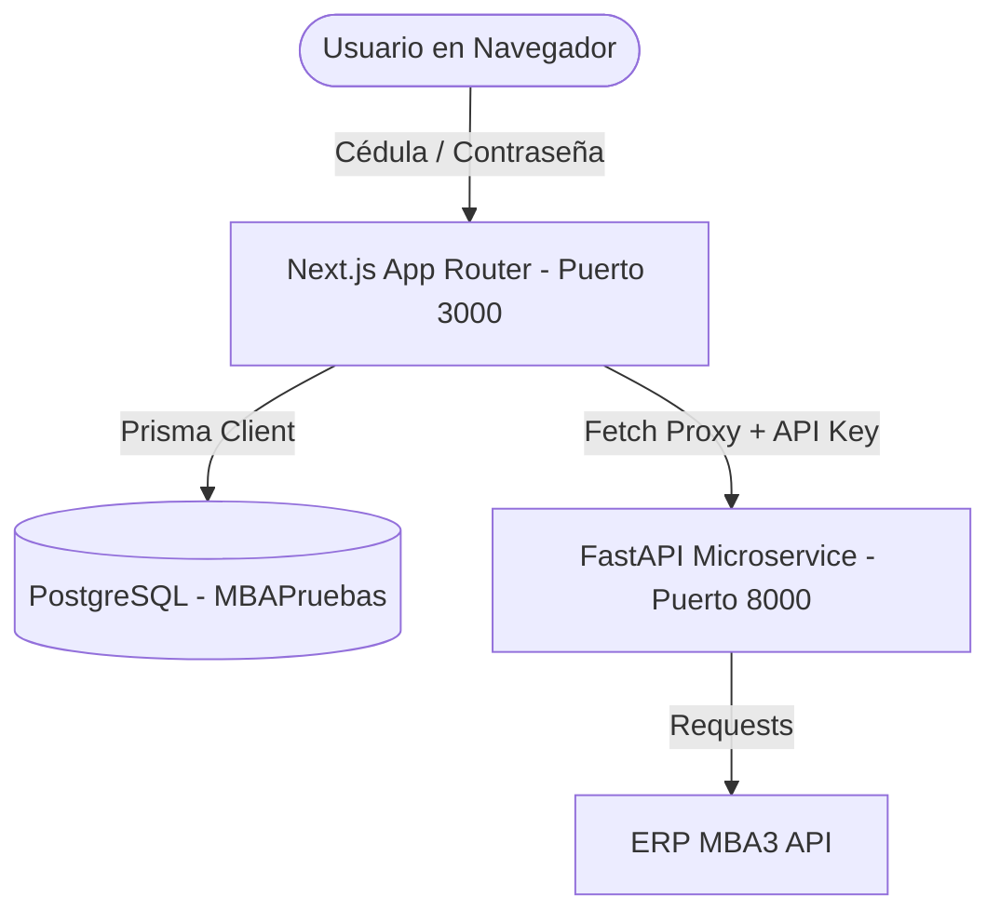

# Walkthrough de la Implementación: Dashboard BI Corporativo

Hemos migrado con éxito la aplicación del MVP básico a una arquitectura empresarial full-stack siguiendo principios SOLID y diseño limpio por capas.

---

## 1. Arquitectura del Sistema

El sistema está dividido en dos microservicios y una base de datos relacional:

### Componentes:
1. **Frontend (Next.js 16 + React 19 + TypeScript)**:
   - Administra sesiones mediante **NextAuth.js**.
   - Conecta a PostgreSQL local mediante **Prisma ORM** con soporte para controladores de base de datos nativos de Node.js (`pg` adapter).
   - Sirve como servidor proxy para no exponer las claves API del backend ni las credenciales del ERP en el navegador del cliente.
2. **Backend (FastAPI + Pandas + Openpyxl)**:
   - Configurado con una **arquitectura por capas** (Controller, Service, Repository, DTO).
   - Realiza la autenticación con el ERP y consulta tablas masivas.
   - Ejecuta los `INNER JOIN` relacionales en memoria RAM utilizando Pandas.
   - Genera reportes de Excel estilizados corporativamente en memoria (`io.BytesIO`) y los sirve como flujos binarios.
3. **Base de Datos (PostgreSQL)**:
   - Almacena los usuarios y los roles del sistema (`Admin` y `Visitante`).
   - Almacena una **bitácora de auditoría** (`DownloadLog`) para registrar qué usuario descarga qué reporte y en qué rango de fechas.

---

## 2. Estructura de Capas del Backend (FastAPI)

El microservicio en Python se reorganizó bajo principios **SOLID**:

*   [Backend/app/config.py](file:///c:/Users/dc4/Desktop/Python%20MBA/Backend/app/config.py): Carga la configuración del archivo `.env` (`python-dotenv`). Permite cambiar entre pruebas y producción sin modificar código.
*   [Backend/app/repositories/mba3_repository.py](file:///c:/Users/dc4/Desktop/Python%20MBA/Backend/app/repositories/mba3_repository.py): Capa de acceso a datos (ERP). Sigue el principio de Inversión de Dependencias (`IMba3Repository`).
*   [Backend/app/dtos/](file:///c:/Users/dc4/Desktop/Python%20MBA/Backend/app/dtos/): Modelos de serialización de Pydantic (`MovimientoDTO`, `LiquidacionDTO`, `AtsDTO`).
*   [Backend/app/services/](file:///c:/Users/dc4/Desktop/Python%20MBA/Backend/app/services/): Lógica de negocio y cruce de datos en DataFrames (`MovimientosService`, `LiquidacionesService`, `AtsService`, `ExcelService`).
*   [Backend/app/controllers/](file:///c:/Users/dc4/Desktop/Python%20MBA/Backend/app/controllers/): Enrutadores de endpoints de FastAPI que validan el `X-API-Key` y ejecutan inyección de dependencias.

---

## 3. Seguridad y Base de Datos (Frontend)

*   **Esquema de Base de Datos** ([prisma/schema.prisma](file:///c:/Users/dc4/Desktop/Python%20MBA/frontend/prisma/schema.prisma)):
    *   `User`: Identificado de forma única por su **Cédula** de identidad. Soporta los roles `Admin` y `Visitante`.
    *   `DownloadLog`: Guarda el ID del usuario, el tipo de reporte ("movimientos", "liquidaciones", "ats"), el rango consultado y el timestamp de la descarga.
*   **Seeding (Semilla)** ([prisma/seed.ts](file:///c:/Users/dc4/Desktop/Python%20MBA/frontend/prisma/seed.ts)):
    *   Siembra de forma automática dos usuarios de prueba en tu base de datos `MBAPruebas` con la contraseña cifrada (`123456` cifrada mediante `bcryptjs`):
        1.  **Administrador**: Cédula `1712345678`, contraseña `123456`, rol `Admin`.
        2.  **Visitante**: Cédula `1712345680`, contraseña `123456`, rol `Visitante`.

---

## 4. Cómo Iniciar y Probar la Aplicación

Ambos servidores están activos en tu máquina en segundo plano:
*   **Backend (FastAPI)**: Ejecutándose en [http://localhost:8000](http://localhost:8000) (documentación interactiva disponible en [http://localhost:8000/docs](http://localhost:8000/docs)).
*   **Frontend (Next.js)**: Ejecutándose en [http://localhost:3000](http://localhost:3000).

### Credenciales de Acceso:
Para ingresar al Dashboard, abre tu navegador en [http://localhost:3000](http://localhost:3000) e inicia sesión con cualquiera de los siguientes usuarios:

| Rol | Cédula | Contraseña | Funciones |
| :--- | :--- | :--- | :--- |
| **Administrador** | `1712345678` | `123456` | Acceso a todos los reportes, descargas de Excel y consulta de la Bitácora de Auditoría completa. |
| **Visitante** | `1712345680` | `123456` | Consulta visual de datos, descargas de Excel y visualización de la Bitácora. |

> [!NOTE]
> Cada vez que descargas un reporte en formato Excel haciendo clic en **"Descargar Excel Certificado"**, se genera una fila de auditoría en la pestaña **Bitácora Auditoría**. Puedes verificarla al instante.
