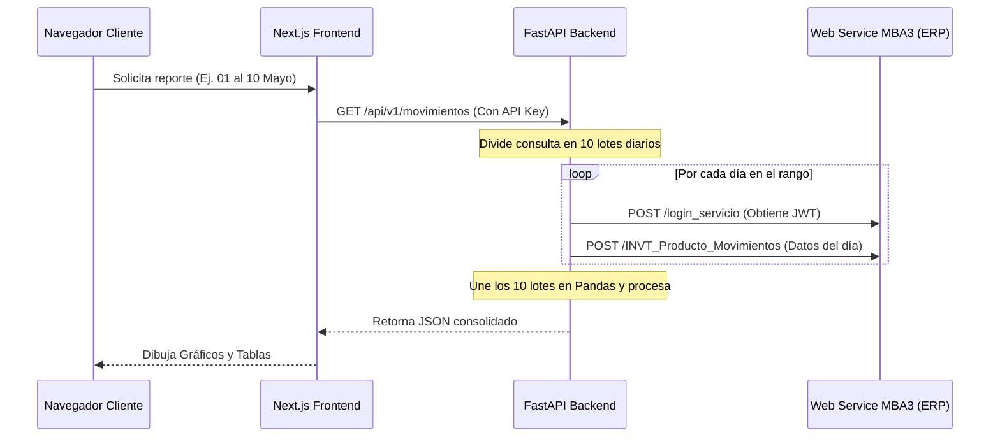
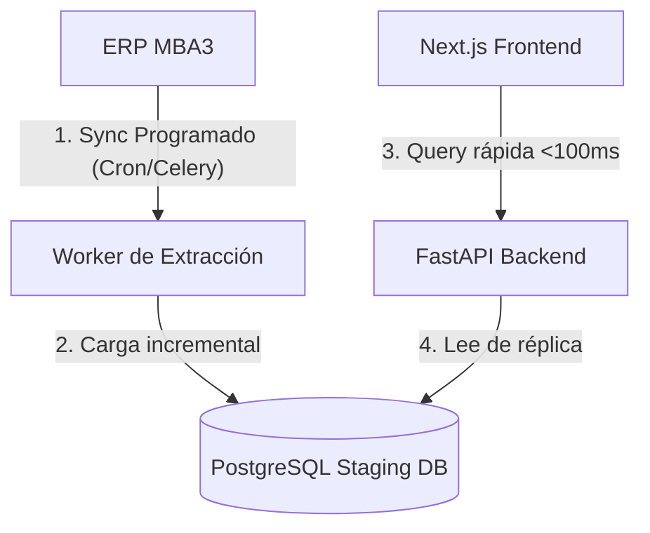

# Informe de Escalabilidad y Mantenibilidad: MBA3 BI Portal

## Resumen Ejecutivo
El MVP (Mínimo Producto Viable) de la plataforma **MBA3 BI** ha sido aprobado con éxito para su pase a producción. Este prototipo inicial validó el flujo de autenticación mediante NextAuth, la integración segura con el ERP MBA3 a través de proxies Nginx, y la manipulación de datos en memoria con FastAPI y Pandas.

Sin embargo, para soportar un mayor volumen de usuarios, consultas masivas, reportes históricos y la adición constante de nuevas lógicas de negocio, es crítico evolucionar la arquitectura actual. Este informe detalla el estado actual, las limitaciones del MVP y una hoja de ruta técnica para asegurar que el sistema sea escalable, rápido y mantenible.

---

## 1. Análisis del Estado Actual (MVP)

La arquitectura actual opera bajo un modelo de **consulta directa bajo demanda**:

### Limitaciones Críticas Detectadas:
1. **Acoplamiento Fuerte y Latencia Excesiva**:
   * Cada reporte del usuario genera consultas HTTP secuenciales al ERP día por día. Si un usuario consulta un rango de 30 días, el backend hace **30 peticiones secuenciales** al ERP en el mismo hilo de ejecución, bloqueando la petición por 20 a 40 segundos.
2. **Ausencia de Caching**:
   * Si dos usuarios consultan el mismo reporte o el mismo usuario recarga la página, el sistema vuelve a realizar toda la secuencia de peticiones al ERP, saturando la red del ERP y el firewall Sophos.
3. **Punto Único de Fallo (SPOF)**:
   * Si el ERP MBA3 está caído, en mantenimiento, o bloquea temporalmente la IP del servidor (como ocurrió recientemente por políticas de firewall), la plataforma entera deja de funcionar para todos los usuarios.
4. **Consumo de Memoria Volátil (Pandas RAM)**:
   * Los datos se recuperan como JSON crudo del ERP, se procesan en la memoria RAM del servidor como DataFrames de Pandas y se retornan. Reportes grandes (más de 100,000 registros) provocarán picos de consumo de memoria que pueden tumbar el contenedor de FastAPI si hay varios usuarios concurrentes.

---

## 2. Hoja de Ruta para Escalabilidad (Rendimiento y Cargas)

Para resolver estos cuellos de botella y preparar la plataforma para albergar cientos de reportes y consultas complejas de manera instantánea, proponemos la transición a un modelo de **Base de Datos de Staging / Réplica**:

### Propuesta Técnica: Arquitectura Orientada a Datos

### 2.1 Staging Selectivo (Datamart) y Carga Incremental (Delta Load)
* **El Desafío del Volumen (ERP de 450 GB)**:
  * El ERP MBA3 tiene un volumen de datos masivo (~450 GB). **No es viable ni necesario realizar una réplica completa** de su base de datos.
* **Solución: Enfoque de Datamart Selectivo**:
  * Solo se extraen e importan las tablas y columnas específicas consumidas por la plataforma de BI (por ejemplo, `INVT_Producto_Movimientos`).
  * Se aplica un filtro histórico para almacenar localmente solo el rango de tiempo requerido para el análisis activo (ej. últimos 2 años). Esto reduce el tamaño local en PostgreSQL a **menos del 1% (~2 a 5 GB)** del total del ERP.
* **Mecanismo de Carga Incremental (Delta Load)**:
  * **Carga Inicial**: Se extrae el histórico consolidado una sola vez.
  * **Sincronización Diaria**: Cada noche a las 2:00 AM, un script ejecuta una consulta rápida al ERP filtrando solo por los registros del día anterior (`TRANS_DATE >= 'ayer'`). Esto transfiere apenas una fracción de megabytes y se completa en segundos.
* **Estrategia Híbrida para Consultas Histórico-Actuales**:
  * Si un usuario solicita un reporte desde una fecha pasada (ej. `2025-01-01`) hasta el **día de hoy en tiempo real** (antes de que corra la sincronización automática de las 2:00 AM), el backend ejecuta los siguientes pasos:
    1. **Consulta Local (Pasado)**: Busca en la base de datos de staging local los registros correspondientes al intervalo desde el inicio del reporte hasta el día de ayer (`2025-01-01` al `ayer`). Esta consulta es instantánea (<100ms) debido a que ya está precalculada e indexada en PostgreSQL.
    2. **Consulta Externa (Presente)**: Realiza una única llamada rápida y dirigida a la API del ERP exclusivamente por los datos generados durante el día en curso (`TRANS_DATE = 'hoy'`). Al tratarse de un rango extremadamente pequeño (solo unas horas del día de hoy), el ERP responde en 1 o 2 segundos.
    3. **Consolidación (Merge)**: El backend unifica en memoria (ej. concatenación de DataFrames en Pandas/Polars) el volumen histórico local y el fragmento del día de hoy, y devuelve al cliente un único set de datos transparente.
  * **Resultado**: El usuario obtiene información al minuto sin sufrir la latencia de consultar todo el histórico en el ERP.

### 2.2 Procesamiento Asíncrono (Colas de Tareas e Integración de Eventos)
* Para consultas históricas muy masivas (ej. "Descargar todo el año 2025 en Excel"):
  * No procesar la descarga en el hilo HTTP principal de FastAPI (evita el error `504 Gateway Timeout`).
  * **Alternativas de Infraestructura para Mensajería y Tareas**:
    * **Redis (Recomendado para inicio rápido)**: Ideal como bróker ligero de mensajería para Celery si la prioridad es facilidad de administración y bajo consumo de recursos en entornos pequeños.
    * **RabbitMQ (Recomendado para robustez corporativa)**: Soporta de forma nativa enrutamiento avanzado de mensajes, reintentos complejos (Dead Letter Exchanges) y entrega garantizada. Es el estándar de la industria al acoplar Celery con FastAPI en producción.
    * **Apache Kafka (Recomendado para flujos de datos continuos / Data Streaming)**: Si en lugar de simples tareas asíncronas se requiere capturar flujos masivos de eventos en tiempo real (por ejemplo, transacciones de múltiples sucursales a medida que ocurren), Kafka permite procesar tuberías de datos (Data Pipelines) con tolerancia a fallos y alta escalabilidad de almacenamiento.
  * **Flujo**: El usuario solicita el reporte, el backend despacha la tarea a la cola (RabbitMQ/Redis/Kafka) y devuelve inmediatamente un `task_id` (`200 Accepted`). Un worker de procesamiento genera el reporte en segundo plano y almacena el resultado listo para descarga.

### 2.3 Caching Dinámico (Redis)
* Almacenar en caché por 1 hora los resultados de los JSONs de reportes agregados que no cambian durante el día. Esto evitará consultas repetidas a la base de datos para dashboards que se consultan constantemente por gerencia.

---

## 3. Hoja de Ruta para Mantenibilidad (Estructura del Proyecto)

A medida que más desarrolladores colaboren y se añadan más querys, es esencial mantener el orden del código:

### 3.1 Limpieza de Archivos Legacy y de Prueba
* Actualmente, el directorio `/Backend` contiene archivos de scripts sueltos (`ATS.py`, `consulta_mba3.py`, `dashboard_server.py`, y varios archivos `.xlsx` temporales).
* **Acción**: Crear una carpeta `scratch/` o `legacy/` para mover estos archivos, dejando únicamente `app/`, `Dockerfile`, `requirements.txt` y `main.py` limpios en la raíz.

### 3.2 Estandarización de las Consultas (SQLAlchemy / Prisma)
* **Frontend**: Continuar usando **Prisma** para control de accesos (RBAC), usuarios y configuraciones administrativas.
* **Backend**: Integrar **SQLAlchemy** o **SQLModel** para mapear la base de datos de staging. Esto evitará escribir código SQL crudo y facilitará las migraciones de base de datos a futuro con **Alembic**.

### 3.3 Robustez de Lógica de Negocio (Arquitectura Limpia)
* Mantener la separación de responsabilidades que ya tiene implementada el backend:
  * **Controllers (API Endpoints)**: Solo validan la entrada y retornan la respuesta.
  * **Services**: Contienen las fórmulas matemáticas de comisiones, parsing de seriales y lógica corporativa.
  * **Repositories**: Consumen datos externos (Postgres o APIs).

---

## 4. Estrategia de Monitoreo y Alertas (Grafana & Loki)

Dado que ya integramos los logs de `mba3-bi-frontend` y `mba3-bi-backend` a Promtail/Loki, podemos crear alertas tempranas en Grafana:

* **Alerta de Falla de Conexión al ERP**:
  * Configurar una alerta en Grafana que dispare un correo o mensaje a Slack/Teams si la cadena `Repository: Error en la autenticación del ERP` o `IP No Autorizada` aparece más de 3 veces en 5 minutos.
* **Métrica de Latencia de Reportes**:
  * Monitorear los tiempos de respuesta de `/api/v1/movimientos`. Si el promedio supera los 15 segundos, indica saturación en las APIs del ERP o necesidad inminente de migrar al modelo de Staging DB.

---

## Conclusiones e Inmediatos Siguientes Pasos

El MVP demostró que el negocio obtiene un valor enorme de estos datos consolidados. Para el paso a producción empresarial, se sugiere priorizar:
1. **Crear las tablas de Staging** en PostgreSQL para movimientos y liquidaciones.
2. **Implementar el script de carga incremental diaria** (ETL) desde el ERP a PostgreSQL.
3. **Migrar los endpoints del dashboard** para que consulten a la base de datos local en lugar de consumir las APIs del ERP en tiempo real.
